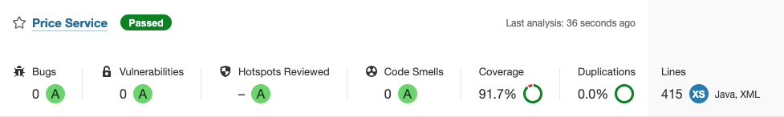

# Price API Service

This is a Spring Boot application designed to provide a REST API for querying product prices based on a specific date, product ID, and brand ID. It uses an in-memory H2 database initialized with sample data to simulate a real-world e-commerce pricing scenario.

---

## Requirements

- **Java 17** (compatible with Java 11)
- **Maven** (or other build tools compatible with Spring Boot)
- **Spring Boot 3.x**

---

## Project Setup

### 1. Clone the Repository
```bash
git clone git@github.com:mikel-c-8086/capitole-technical-test.git
cd capitole-technical-test
```

### 2. Build the Application
```bash
mvn clean install
```

### 3. Run the Application
```bash
mvn spring-boot:run
```

The application will start on `http://localhost:8080`.

---

## API Documentation

### SwaggerUI

The application provides interactive API documentation using **SwaggerUI**, which makes it easier to explore and test the API endpoints.

1. Start the application.
2. Access the SwaggerUI at:
   ```
   http://localhost:8080/swagger-ui.html
   ```

### Features of SwaggerUI:
- Interactive documentation for all API endpoints.
- Sample request and response structures.
- Ability to execute API calls directly from the browser.

---

## API Overview

### Endpoint: `/api/prices`

#### Request Parameters:
- **`applicationDate`** (String): The date and time for which the price needs to be queried (Format: `yyyy-MM-dd'T'HH:mm:ss`).
- **`productId`** (Integer): The identifier of the product.
- **`brandId`** (Integer): The identifier of the brand.

#### Response:
A JSON object containing:
- **`productId`**: Identifier of the product.
- **`brandId`**: Identifier of the brand.
- **`startDate`**: Start date of the applicable price list.
- **`endDate`**: End date of the applicable price list.
- **`price`**: Final price.
- **`currency`**: ISO currency code.

#### Example Request:
```http
GET /api/prices?applicationDate=2020-06-14T10:00:00&productId=35455&brandId=1
```

#### Example Response:
```json
{
  "productId": 35455,
  "brandId": 1, 
  "price": 35.50,
  "startDate": "2020-06-14T00:00:00",
  "endDate": "2020-12-31T23:59:59",
  "currency": "EUR"
}
```

---

## Database Initialization

The application uses an in-memory H2 database. The schema and sample data are initialized at startup.

### Sample Data

| BRAND_ID | START_DATE              | END_DATE                | PRICE_LIST | PRODUCT_ID | PRIORITY | PRICE  | CURR |
|----------|-------------------------|-------------------------|------------|------------|----------|--------|------|
| 1        | 2020-06-14T00:00:00    | 2020-12-31T23:59:59    | 1          | 35455      | 0        | 35.50  | EUR  |
| 1        | 2020-06-14T15:00:00    | 2020-06-14T18:30:00    | 2          | 35455      | 1        | 25.45  | EUR  |
| 1        | 2020-06-15T00:00:00    | 2020-06-15T11:00:00    | 3          | 35455      | 1        | 30.50  | EUR  |
| 1        | 2020-06-15T16:00:00    | 2020-12-31T23:59:59    | 4          | 35455      | 1        | 38.95  | EUR  |

---

## Tests

### Test Cases

The application includes unit and integration tests for the following scenarios:

1. **Test 1**: Request at `2020-06-14 10:00:00` for product `35455` and brand `1`.
2. **Test 2**: Request at `2020-06-14 16:00:00` for product `35455` and brand `1`.
3. **Test 3**: Request at `2020-06-14 21:00:00` for product `35455` and brand `1`.
4. **Test 4**: Request at `2020-06-15 10:00:00` for product `35455` and brand `1`.
5. **Test 5**: Request at `2020-06-16 21:00:00` for product `35455` and brand `1`.
6. **Test 6**: Request for a product with no applicable price returns a `404 Not Found` response.
7. **Test 7**: Request with invalid input returns an `500 Internal Server Error` response.

### Running the Tests
```bash
mvn test
```

Test results are printed to the console and validate the expected output for the example data provided.

---

## Design and Development Highlights

### Domain-Driven Design (DDD)

This project adheres to the principles of **Domain-Driven Design** (DDD), which ensures that the core business logic is the primary focus of the application. Key aspects of the DDD implementation include:

- **Entities:**
    - The `Price` class represents the core domain entity. It encapsulates the attributes and behaviors associated with pricing.

- **Domain Services:**
    - The `PriceService` interface and its implementation (`SimplePriceService`) handle the core business rules, such as filtering prices and determining priorities.

- **Repositories:**
    - The `PriceRepository` interface provides an abstraction for persisting and retrieving domain entities without exposing implementation details.

- **Separation of Concerns:**
    - By leveraging a layered architecture, the project isolates domain logic from infrastructure and application concerns, ensuring maintainability and scalability.

### Hexagonal Architecture

- Ensures separation of concerns between domain logic, infrastructure, and API layers.
- Facilitates testing by allowing mock implementations of dependencies like repositories.

### Clean Code Practices

- Follows industry best practices for naming conventions, dependency injection, and modularity.
- Includes comprehensive unit and integration tests.

---

## Sonar Coverage and Code Quality

The project demonstrates strong code quality and test coverage, as analyzed by SonarQube. Coverage metrics ensure that a significant portion of the code is covered by automated tests, reducing the risk of undetected issues and improving maintainability.



---

## How to Contribute

1. Fork the repository.
2. Create a feature branch.
3. Commit your changes with descriptive messages.
4. Submit a pull request.

---

## License

This project is licensed under the MIT License. See the `LICENSE` file for more details.

---

## Contact

For further queries or support, contact the author at `mikelc80@gmail.com`.
